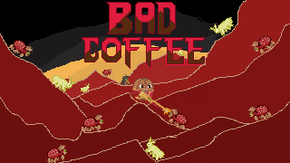

# ☕ Bad Coffee



Um jogo de **Cafés VS Pragas**, baseado em *Brotato* e *Vampire Survivors*.

---

## 1. Identificação do Projeto

**Título do Projeto:** Bad Coffee

**Desenvolvedores:**
- João Pedro Keidann
- Abel Silva Neto
- Davi Pereira Fagundes
- Pedro Henrique Caldart Warmling

**Professor orientador / Product Owner:** Carlos Roberto Da Silva Filho

**Logotipo/Banner:** a imagem no topo deste README é a arte de fundo do menu principal do jogo (`Img/menu.png`).

---

## 2. Visão Geral do Sistema

### Descrição

Bad Coffee é um jogo web (HTML5 Canvas + JavaScript puro) do gênero *survivors-like*: seu personagem (um grão de café) precisa sobreviver a ondas cada vez maiores de pragas da lavoura, atirando automaticamente nos inimigos mais próximos enquanto coleta XP para evoluir.

### Objetivo

Sobreviver às ondas de inimigos, evoluir o café com armas e itens, e derrotar o chefe final (Quesada Gigas) para salvar o cafezal.

### Tema

O jogo se passa dentro de uma lavoura de café, onde grãos de café (os jogadores) enfrentam pragas típicas da cultura cafeeira — ácaro-vermelho, broca-do-café, bicho-mineiro, ninfas e larvas — que tentam destruir a plantação. O objetivo final é resistir a 3 fases de ataques e vencer a praga-chefe, Quesada Gigas (a cigarra-do-café).

### Instruções de Jogabilidade

**Controles — Jogador 1 (Solo ou Cooperativo):**
| Tecla | Ação |
|---|---|
| `W` | Mover para cima |
| `A` | Mover para a esquerda |
| `S` | Mover para baixo |
| `D` | Mover para a direita |

**Controles — Jogador 2 (somente no modo Cooperativo):**
| Tecla | Ação |
|---|---|
| `↑` | Mover para cima |
| `←` | Mover para a esquerda |
| `↓` | Mover para baixo |
| `→` | Mover para a direita |

As armas atiram **automaticamente** no inimigo mais próximo — não é necessário mirar. O mouse é usado apenas para navegar nos menus e escolher as cartas de upgrade ao subir de nível.

**Coletáveis (itens escolhidos ao subir de nível):**

*Armas (até 3 equipadas por vez):*
- **Pistola P320** — tiro simples e rápido.
- **Metralhadora MP5** — rajada de 3 tiros.
- **Escopeta KS-23** — dispara em cone, atinge vários inimigos.
- **Sabre de Luz** — arremesso em bumerangue, atravessa inimigos.
- **Adaga** — orbita ao redor do jogador, atingindo quem chega perto.
- **Gjallahorn** — lança um foguete que explode em área ao acertar.

*Itens passivos (até 2 equipados por vez):*
- **Adrenalina (Seringa)** — aumenta a velocidade de movimento.
- **Armadura** — reduz o dano recebido.
- **Leite** — aumenta a regeneração de vida por segundo.
- **Casca de Café** — aumenta a vida máxima.

### Especificações Técnicas

- **Progressão de fases:** o jogo é dividido em **3 Fases**, cada uma com **3 Waves** de inimigos. Ao concluir a Wave 3 de uma fase, o jogo avança para a próxima fase (com uma transição visual de tela entre elas).
- **Boss:** na Wave 3 da Fase 3, surge o chefe final, **Quesada Gigas**. Derrotá-lo é a condição de vitória.
- **Vida:** cada jogador tem uma barra de vida (HP), reduzida pelo contato/ataque dos inimigos e recuperada aos poucos pelo item Leite (regeneração). A Armadura reduz o dano recebido. Não há "vidas extras": ao zerar a vida (dos dois jogadores, no modo cooperativo), a partida termina em uma tela de Derrota.
- **Progressão/pontuação:** em vez de uma pontuação numérica tradicional, o jogo usa um sistema de **XP e Nível** — inimigos derrotados dão XP, e ao subir de nível o jogador escolhe uma nova arma/item entre opções sorteadas.
- **Áudio:** trilha sonora dinâmica (uma música para as Fases 1 e 2, outra para o confronto com o chefe, com fade entre as duas) e efeitos sonoros próprios para cada arma.

### Créditos

Projeto desenvolvido por João Pedro Keidann, Abel Silva Neto, Davi Pereira Fagundes e Pedro Henrique Caldart Warmling, sob orientação do professor Carlos Roberto Da Silva Filho.

As trilhas sonoras usadas são licenciadas pelo [Uppbeat](https://uppbeat.io) (free for Creators) — os créditos completos também aparecem na tela "Sobre" dentro do próprio jogo.

### Link de Produção

🔗 **Jogo em produção (Vercel):** https://bad-coffee.vercel.app/

---

## 3. Instruções de Instalação e Execução

Siga os passos abaixo para rodar o projeto localmente:

### 1. Clonagem

```bash
git clone https://github.com/jpkeidann/Bad_Coffee
cd Bad_Coffee
```

### 2. Instalação de Dependências

```bash
npm install
```

> Obs.: o projeto é feito em HTML, CSS e JavaScript puro (sem frameworks ou bibliotecas externas), então esse passo não instala nenhuma dependência no momento — mas já deixamos o comando pronto caso alguma seja adicionada no futuro.

### 3. Execução do Projeto

Não é necessário nenhum servidor especial. Duas formas de rodar:

- **Direto no navegador:** abra o arquivo `index.html` (duplo clique ou "Abrir com" o navegador de sua preferência).
- **Com um servidor local** (recomendado, evita eventuais bloqueios de CORS/áudio do navegador): usando a extensão **Live Server** do VS Code, ou rodando no terminal:
  ```bash
  npx serve .
  ```
  e acessando o endereço indicado no terminal (ex.: `http://localhost:3000`).

### 4. Link do Sistema em Produção

🔗 https://bad-coffee.vercel.app/